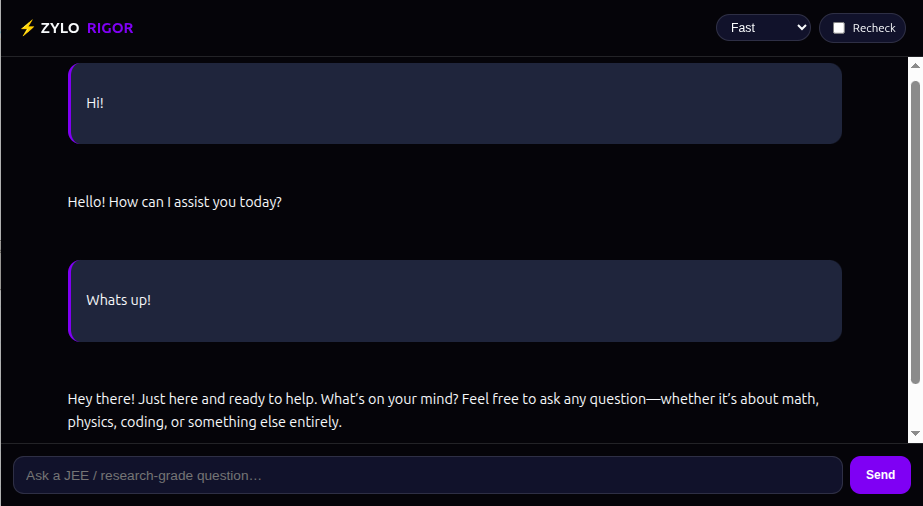
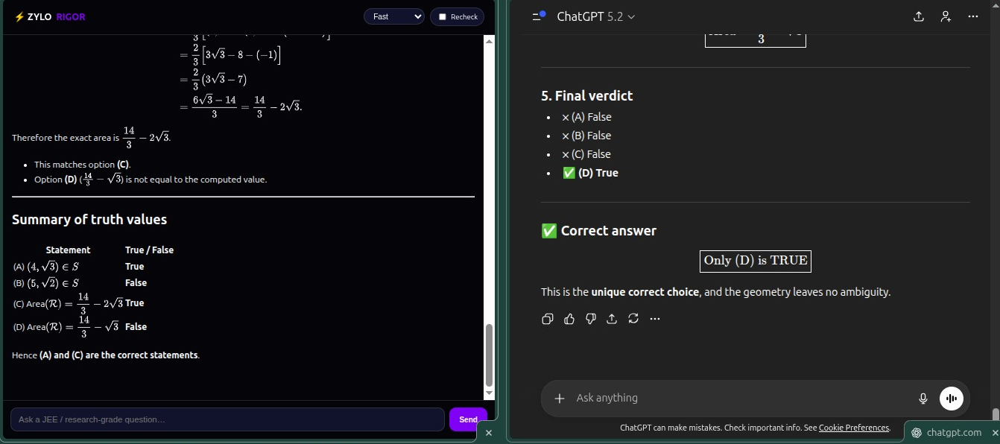

# ZYLO-RiG0R

ZYLO-RiG0R is an ultra-fast, research-grade math & physics reasoning engine built on GPT-OSS-120B with Cerebras-accelerated inference and strict tool-augmented computation.

Unlike generic chat systems, ZYLO-RiG0R forces verified computation, executes sandboxed Python and SymPy, and optionally rechecks proofs using GLM-4.7, ensuring results are correct, reproducible, and defensible.

It is designed to outperform top-tier AI models on calculation-heavy, exam-level, and research-grade problems by eliminating hallucinations and unverifiable reasoning.


<p align="center">
  
</p>

---

## Why ZYLO-RiG0R Exists

Modern LLMs are optimized for fluency, not correctness.
ZYLO-RiG0R was built to solve that failure mode.

### ZYLO-RiG0R enforces:

- Tool-only execution when computation is required

- Strict JSON-based tool invocation

- Sandboxed Python execution with resource limits

- Symbolic verification using SymPy

- Independent proof rechecking via GLM-4.7

- MathJax-safe mathematical rendering

- Phase-aware inference (Planning → Execution → Exposition)

#### The result is a system that cannot “fake” answers.


## Core Capabilities

- 🚀 Ultra-low-latency inference via Cerebras

- 🧮 Guaranteed computation correctness (Python + SymPy)

- 🔒 Sandboxed execution with CPU & memory limits

- 📐 Research-grade math normalization

- 🔁 Optional independent proof verification

- 🌐 Minimal, distraction-free web UI

- ⚙️ Reasoning-level control (Fast / Balanced / Research)


## Philosophy

"If a result cannot be verified, it is not an answer."

### ZYLO-RiG0R prioritizes:

- Correctness over verbosity

- Verification over explanation

- Results over rhetoric


## Who This Is For

- JEE / Olympiad / university-level students

- Researchers and engineers

- Anyone who cares about correct answers, not confident lies


## Status

#### ⚠️ Experimental / Research System
This project pushes LLMs beyond conversational use into formal reasoning infrastructure.


---

## Architecture Overview

ZYLO-RiG0R is built as a **phase-aware reasoning pipeline** that strictly separates thinking, computation, and exposition.

At a high level, every request flows through the following stages:

1. **Planning Phase**
   - High-entropy reasoning to understand the problem
   - Decides whether verified computation is mandatory

2. **Execution Phase**
   - Forces tool-only execution when required
   - Runs sandboxed Python or SymPy with strict CPU and memory limits
   - Blocks natural-language output during computation

3. **Exposition Phase**
   - Converts verified results into human-readable explanations
   - Guarantees that computed values explicitly appear in the final answer

4. **Optional Proof Recheck**
   - Independently validates results using GLM-4.7
   - Assigns confidence based on verification verdict

This architecture prevents hallucinated results by **design**, not by prompt tuning.


---

## Installation

### Requirements

- Python 3.9+
- Linux or macOS (sandboxed execution required). Windows is not preferred.
- Cerebras API access
- GLM-4.7 API key (optional, for proof rechecking)

### Install Dependencies

```bash
pip install flask flask-cors requests cerebras-cloud-sdk sympy numpy regex jsonschema rich python-dotenv scipy
```


## Requirements
To run the code replace the placeholders of Cerebras and GLM 4.7 API key with your own api keys. Both Crebras and Zhipu AI(GLM 4.7) offer free API key with some limits. The limits are enough for general work. Just login and get started.
### The free-tier limits:
<p align="center">
  
  
</p>

##### Get Cerebras AI API ket at-
https://cloud.cerebras.ai/platform/get-started
##### Get Zhipu AI API key at-
https://open.bigmodel.cn/usercenter/proj-mgmt/apikeys

<p align="center">
  
</p>


## Specials
ZYLO-RiG0R is specialized for mathematics and physics. It can correctly answer complex question before popular models like GPT 5.2, Gemini 3 PRO etc start thinking.
This system is also seen to beat GPT 5.2 sometimes. ZYLO-RiG0R gave the correct answer where GPT 5.2 produced wrong answer.
ZYLO-RiG0R also produces most of the answers within 1-2s.


<p align="center">
  
</p>

<p align="center">
  
</p>
